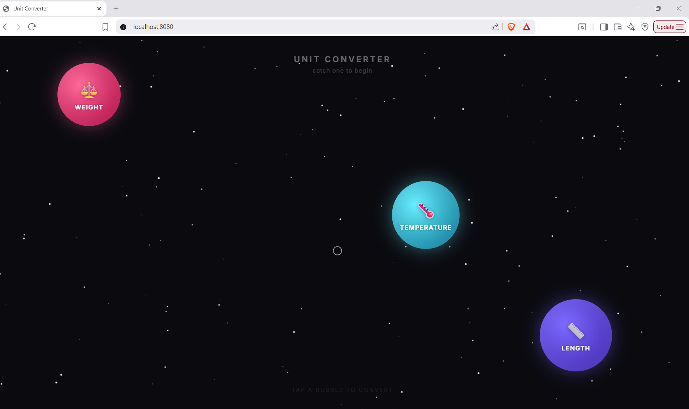
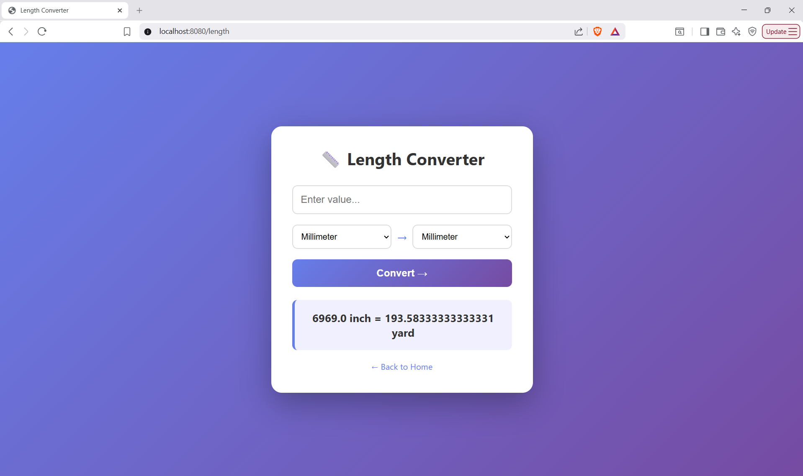
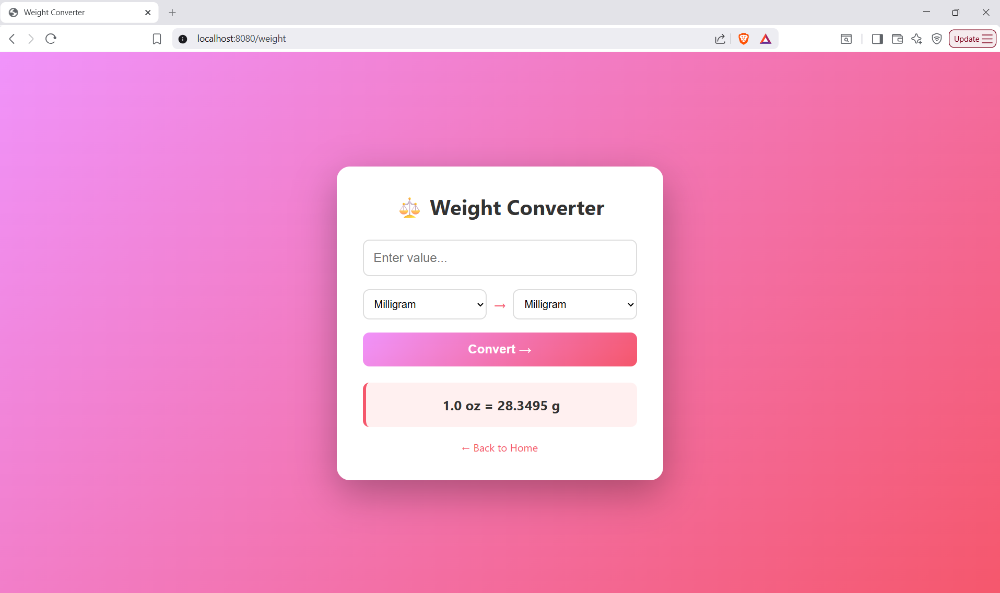
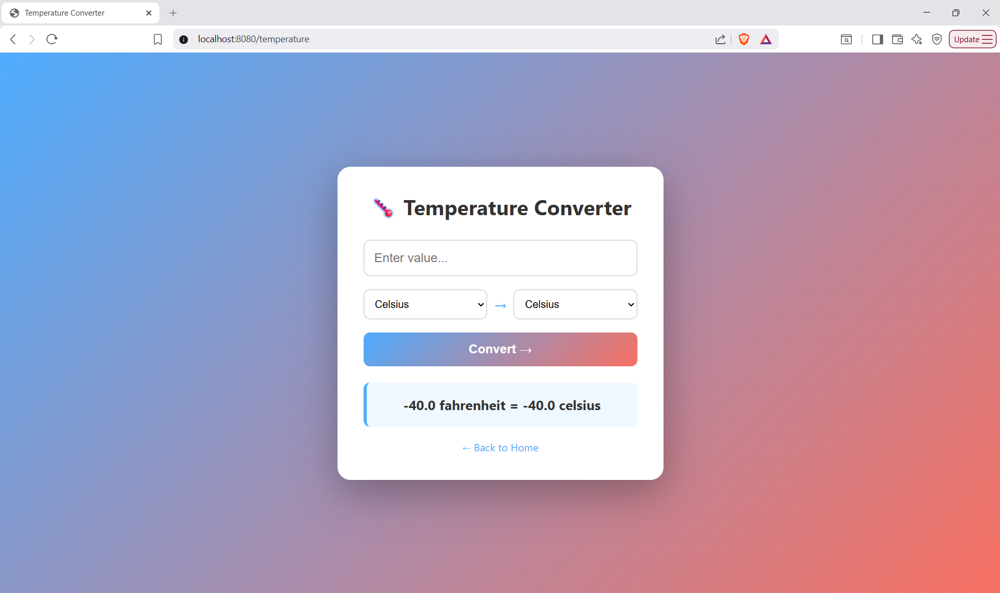

# Unit Converter

A web-based unit converter built with Java Spring Boot and Thymeleaf. Converts between units of length, weight, and temperature via a server-side MVC architecture.

## Live Demo
## Live Demo
project URL
🔗 [Live App](https://unitconverter-j8k5.onrender.com)

*Note: hosted on Render's free tier — first load may take 30-60 seconds if the app has been idle.*

## Screenshots
## Screenshots

### Homepage

### Length Converter

### Weight Converter

### Temperature Converter

## Features
- Length: millimeter, centimeter, meter, kilometer, inch, foot, yard, mile
- Weight: milligram, gram, kilogram, ounce, pound
- Temperature: Celsius, Fahrenheit, Kelvin
- Playful interactive homepage with floating bubbles
- Server-side conversion logic with Spring Boot MVC

## Tech Stack
- Java 21
- Spring Boot 3.4.5
- Thymeleaf
- HTML/CSS/JavaScript
- Maven

## Run Locally

### Prerequisites
- JDK 21+
- Maven

### Steps
1. Clone the repo
   git clone https://github.com/Jatin4269/unit-converter.git

2. Navigate to project
   cd unit-converter

3. Run the app
   ./mvnw spring-boot:run

4. Open browser
   http://localhost:8080

## Project Structure
src/
├── main/
│   ├── java/com/jatin/unitconverter/
│   │   ├── UnitconverterApplication.java
│   │   ├── HomeController.java
│   │   ├── LengthController.java
│   │   ├── WeightController.java
│   │   └── TemperatureController.java
│   └── resources/
│       └── templates/
│           ├── index.html
│           ├── length.html
│           ├── weight.html
│           └── temperature.html

## Author
Jatin Sharma
[LinkedIn](https://www.linkedin.com/in/jatin4269) | [GitHub](https://github.com/Jatin4269)
